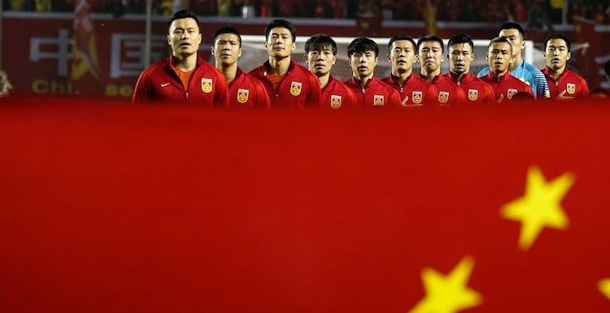
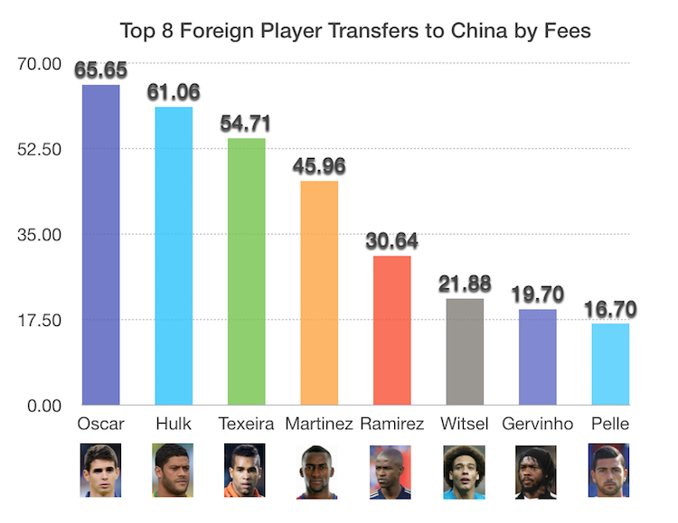
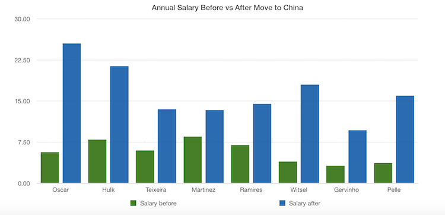
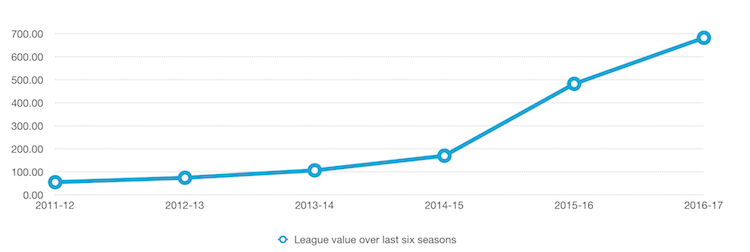
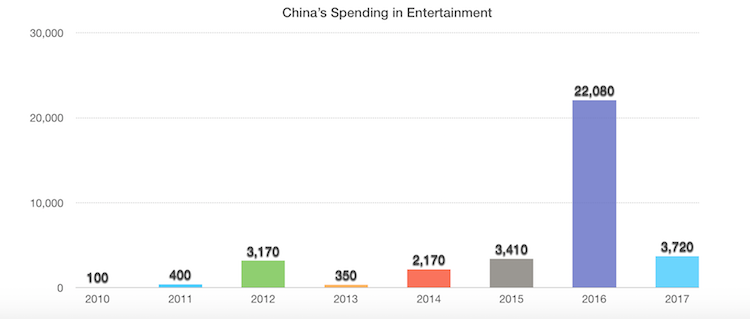
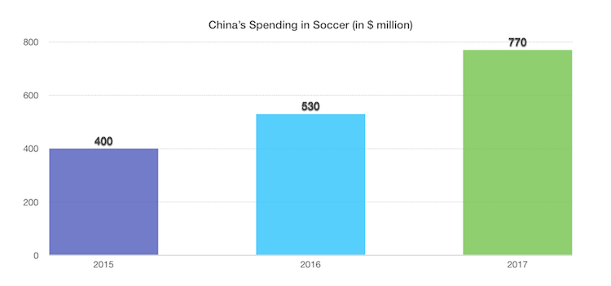

---

title: A Very Cool Project
layout: project

---

# China’s soccer invasion of Europe in a shambles? 

*by Christos Gavalas*

Last week China’s cabinet placed its sport clubs on the list of local companies what are not allowed to invest overseas in a move that follows on the footsteps of late last year’s campaign to curb capital outflows. 

According to a **Bloomberg** report, the outflows include what government calls "irrational investments" and the decision aims at protecting the yuan from ***further depreciation***. 

But what were the uncontrollable actions that took place in the last few years that ultimately needed to be contained? 

Why and in what ways did China decide to heavily invest in soccer in the first place? 

Our **data analysis** investigates the numbers behind one of the running decade’s *most prominent financial developments in the world of soccer* and takes a closer look at its repercussions both in China and abroad. 

## It all started from the very top 

Behind the country’s surge in soccer investments is the body that is now trying to hold them back: the government itself and notably its own President, **Xi Jinping**, who announced a plan in 2015 according to which China would be transformed into a world beater at the sport. 

His plan revolved around the **cleaning and reorganization of professional soccer** in the country with the inclusion of new programs in thousands of schools, aiming at eventually establishing a constant flow of players who’d be able of even winning the World Cup.

That resulted in China’s top teams spending hundreds of millions of dollars to hire foreign stars like Brazilian midfielder **Oscar** from Chelsea or striker **Hulk** from Zenit. 

That came at the detriment of their expenses: the transfer fees they had to pay were as high as $65.65 million (payable to Chelsea by Shangai SIPG) in the case of Oscar. 

But with no exceptions, all interested chinese teams would have to double, triple or even quadrille the salaries of the stars they signed in an attempt to lure them in the otherwise weak Chinese League. 

Subsequently what came about was a **huge increase** in the value of the league itself over the last seven years. According to **transfermarkt**, from $54.99 million in 2011, the estimated value of the league rose up to an all time record high last year at $628.12 million.

## Not just players: chinese companies largely invest in european teams  

But it’s not just the European players reaping the benefits of such frenetic spending. 

Some of the most storied european clubs have been bought by **investors from the Far East**, a situation that has gotten them off the financial hook. 

More specifically, the flood of Chinese money is poured into an estimated 29 foreign soccer clubs in the past four years including powerhouses like **AC Milan**, a team that has been a shadow of the glamorous squad who won the Champions League in 2007.  

It was bought by a Chinese consortium in April for $788 million in a troubled deal that was only finalized eight months after it was initially agreed. 

According to the statement issued by ex-owner of AC Milan who’s also ex Italian Prime Minister, Silvio Berlusconi, "the buyers confirmed their commitment to undertake significant capital increases and liquidity injections aimed at strengthening Milan’s financial structure".    

The purchase of one of Italy’s most famed team is the biggest Far East investment in a european soccer club and has totally captured the interest of the city of Milan, only a year after retail giant **Sunning Commerce Group** bought its rivals, *Inter Milan*. 

Both teams had been doing terribly in recent years —being out of european competition this year due to their poor performance in their local league— which had been placing extra pressure on their longtime owners to sell their shares.  

However, the phenomenon has spread in other prestigious league such as the *Premier League* and the *La Liga*. 

In England, it is indicative that **Southampton Football Club** was recently bought by tycoon Gao Jisheng becoming the third British team after West Bromwich and Aston Villa that are already under Chinese control. 

And in Spain, Dalian Wanda Group owns 20% of **Atletico Madrid**.

## Strategic economic shift towards entertainment to spur consumer spending  

The soccer spending frenzy reflects a broader governmental tendency to invest in the ***entertainment industry*** in China that has seen **explosive growth** in recent years, growing at a much faster pace than the overall economy in an effort to rebalance it away from exports and towards consumer spending and services. 

Approximately, in 2010 there had been only $100 million invested in entertainment whereas last year this number went up at the levels of more than **$2 trillion**!  

And by breaking down the numbers in entertainment’s subsection of soccer we see that in the last three years the amount of money Chinese capitalists have invested in the "beautiful sport" to buy european club shares has also been on the rise. What’s enormously indicative is that even half of 2017 is enough to surpass the total of 2016 in that respect.

## Sports teams now in a restricted zone

Eventually, as the spending frenzy kept on going until this summer and the transfer marker window now open in Europe until early September, the government stopped taking a back seat. 

The new imposed restrictions will probably **come as a blow** for many Chinese clubs that will now likely make sales, according to the chairman of UK -based soccer deal adviser, Blackbridge Cross Borders. **Alexander Jarvis** spoke to Bloomberg saying he thinks many deals will be derailed while some other teams will find ways to get around the rules. 

-----------------

Sources: [Transfermarkt](https://www.transfermarkt.com/), [China Global Investment Tracker](http://www.aei.org/china-global-investment-tracker/), [Bloomberg](https://www.bloomberg.com/news/articles/2017-08-18/for-european-soccer-teams-flood-of-chinese-money-seen-drying-up), [HITC - Most expensive transfers in China](http://www.hitc.com/en-gb/2017/01/16/top-10-most-expensive-players-in-chinese-super-league-history/)

