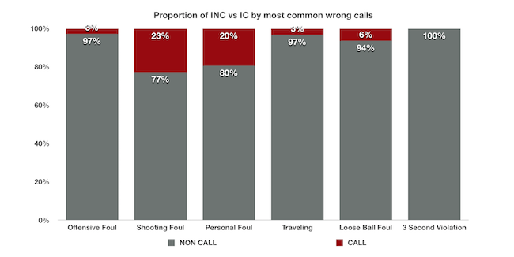
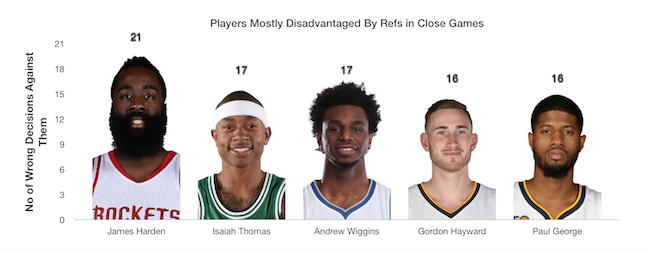

---

title: A Very Cool Project
layout: project

---

# NBA refs mistakes: Down the stretch, the whistle is not blown

*by Christos Gavalas*

In the heat of the moment and as a close NBA game comes to an end, players have all eyes on them and referees are expected to get it dead right. But in wanting to do so they steadily prefer to let the game be more physical and don’t intervene much. That’s where the vast majority of their mistakes comes from, data insist.

In March 2015, the NBA took a huge step in reinforcing its position as the leading sporting association in the world by reviewing plays from all games that enter their last two minutes with a five point lead, at the most.  

But when it comes to the type of wrong decisions refs make at the end of close games, the top 10 list is increasingly filled in with incorrect non calls: offensive and personal fouls not called, fouls on a shooting attempt and on a loose ball not called as well as traveling violations ignored. 

Here’s a look at one of the most common non call violations:

Actually, when it comes to **wrong decisions** by referees in the last two minutes, non calls amount to 89% of the total whereas incorrect calls measure up to only 11%.

## Much critique but refs still get it mostly right  

The report for each game is released typically the next day and is intended to provide extra transparency around debated calls. But despite the good intentions it wasn’t positively accepted by neither the referees nor the players.

Both **LeBron James** and **Kevin Durant**, the undeniably best offensive duo of the league, have been vocal about the dangers associated with the measure. 

"You don’t throw the refs under the bus like that ‘cause the next game, that group of refs, whoever it is, gonna come out and be tense when they’re refereeing the game and they’re gonna try to get every play right, try to be perfect without just going out there and relaxing and making the right call", Durant said in **December 2016** after a loss to the Cleveland Cavaliers in which the Golden State Warriors super star *wasn’t awarded a foul* in the last few seconds that could have changed the winner.  

But even LeBron James whose team won on that night admitted he *should have been given a technical* for hanging on the rim after a dunk and stated that "it’s not fair to the referees that you only talk about the final two minutes and not the first 46".

What needs to be pointed out though is that referees can definitely take pride in the high percentage of the actual correct calls they make. Even after evaluation and examination of all reports during the roughly three seasons, refs are correct over 89% of the time. 

Correct non calls and correct calls are dominant (13.758) compared to the incorrect non calls and incorrect calls (1.601) which however draw the attention of the public. 

And aside from this, the **National Basketball Referees Association (NBRA)**, which represents the 63 active NBA referees, believes that the subjective nature of what is considered a foul and necessitates a whistle undermines the validity of the non-calls assessed to be incorrect. 

"People forget that perfection is impossible, especially when it comes to officiating the greatest athletes in the world," said **Lee Seham**, National Basketball Referees Association General Counsel in May 2015, a few months after the initiative was introduced. 

According to their view, flow of game, how the possible contact influenced the play, speed of play and having just six eyes watching the greatest athletes in the world – all of these factors influence the referees’ decision to blow the whistle. 

## Who’s the most advantaged and disadvantaged player?

According to the data, **Marcin Gortat** of the Washington Wizards is the most advantaged player by referees in the last two minutes of close games having received to his favor almost 30 incorrect calls or non calls. He is followed in the list by Al Horford of the Boston Celtics, James Harden of the Houston Rockets, Brook Lopez of the Los Angeles Lakers and Daymond Green of the Golden State Warriors.  

On the flip side, **James Harden** is counted as the most disadvantaged player by refs, followed by Andrew Wiggins of the Minnesota Timberwolves, Isaiah Thomas of the Boston Celtics, Paul George of the Indiana Pacers and Gordon Hayward of the Boston Celtics. 

-----------------

Note: The original reports are PDFs but journalist **Russell Goldenberg** has been converting them to spreadsheet-friendly CSVs that we were able to work with.

Sources: [The Last Two Minute Report](http://official.nba.com/nba-last-two-minute-reports-archive/), [Polygraph Cool](https://github.com/polygraph-cool/last-two-minute-report/tree/master/output)

