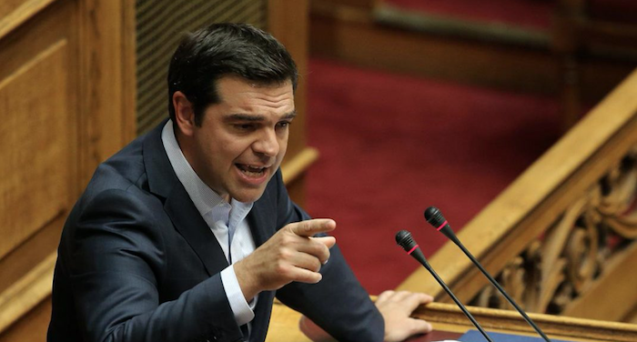
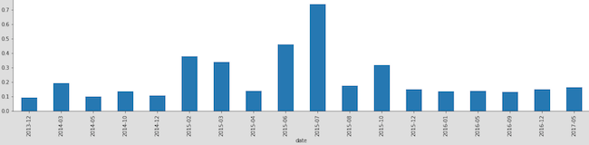
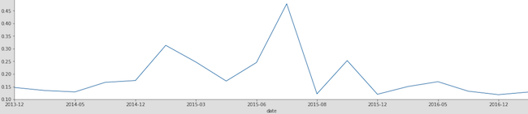
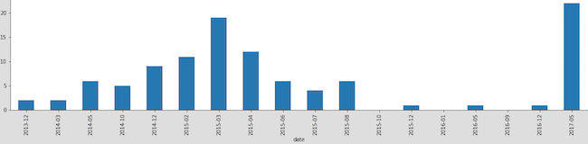

---

title: A Very Cool Project
layout: project

---

# When Greek PM doubled back on MoU, his words spoke volumes
--

*by Christos Gavalas*

In early 2015, Syriza, the greek leftist party until then in opposition, came to power promising to confront the 'troika' of Greece’s creditors and terminate austerity under which people were suffering. 

However, six months of high-drama negotiations -followed by a national referendum- later, **Alexis Tsipras**, the party's president and elected Greek PM, signed a third memorandum lumbering on implementing **anti-left measures** of historic magnitude. 

But how much of this unprecedented capitulation was reflected in his speeches in parliament? 

Did the sentiment of his speeches change as the country was getting closer to a possible EU exit? 

And how much of this sentiment was actually based on the sentiment of his own words?   

Through the **sentiment analysis** of most of the key speeches he gave in parliament before and after the signing of the third MoU, we get a clearer picture of his **feelings’ variation** and *tend to conclude* that his monumental double back was connected with much more heavy - loaded addresses.   

## Method of analysis  

For our analysis we used the **Emotional Lexicon** that includes all kind of words and defines whether they determine anger, anticipation, disagreement etc. or more generally whether they have a negative or positive inclination. 

Each word of the lexicon is assigned a number (0 or 1) based on whether it represents a given sentiment (0=False, 1=True). 

The **TdifVectorizer** will help us define the level of positivity/negativity by giving us back a percentage of usage of words with positive/negative aspect within a speech, whereas through the **CountVectorizer** will bring us in a position to look into how many times a specific set of words appears in each speech.

## In July 2015 his speeches got emotionally loaded 

We grouped our sample of 25 Mr Tsipras’ speeches in parliament by month - year and marked the **July 2015** date time as the defining moment of this analysis, as this was the time when he agreed to terms with the European creditors. 

More specifically, we examined the level of negativity and positivity of his speeches over time by adding up each negative and positive used word’s percentages in each speaking which resulted into a decimal number. 

For both cases we came up with the same finding: on that month the sentiment of this wording spiked.   

## Usage of word ‘memorandum’ nearly diminished after he signed it 

In the years and months preceding the date of the MoU signing in Brussels in a dramatic night long session, Mr Tsipras seems to have been very adamant in using the word **‘memorandum’** in his parliamentary speeches to directly criticize the previous government and to hold out to his partisan voters. 

But right after he accepted to initiate a third bailout program with the EU creditors, he radically changed the course of his discourse, and ceased using the word almost entirely, with the exception of last May’s speech before the parliament. 

Referring to the voting of yet another tough set of measures that would serve in finalizing the second review, which would lead to another disbursement, the Prime Minister, utilized the word in his rhetorics more than ever, creating thus a notable outlier. 

This trend is presented clearly in the data. In the period prior to the MoU signing he had used the word 76 times, whereas in the period right after, the use was significantly decreased to only 9 times in the course of 22 months, with the exception of his May speech. 

## What does this mean? 

This clearly shows the fluidity of rhetorics and discourse in Greek politics. Greece appears to be one of the only highly developed states which demonstrates such radical changes in policy positioning. This is only exasperated by the duality of PM Tsipras’ rhetoric abroad. 

From the one hand the PM seems to be completely in agreement with the european side after signing the third MoU, however in the domestic scene the PM still maintains fiery anti-austerity rhetorics for internal consumption purposes. 

Perhaps this explains very well the case of our May outlier speech as it was an attempt to justify his choices domestically blaming the conservative opposition party -which has a dominant lead in polls- of being the instigator of the austerity brought by the MoU in the first place. 

-----------------

Note: The original reports are PDFs but journalist **Russell Goldenberg** has been converting them to spreadsheet-friendly CSVs that we were able to work with.

Sources: [The Last Two Minute Report](http://official.nba.com/nba-last-two-minute-reports-archive/), [Polygraph Cool](https://github.com/polygraph-cool/last-two-minute-report/tree/master/output)

