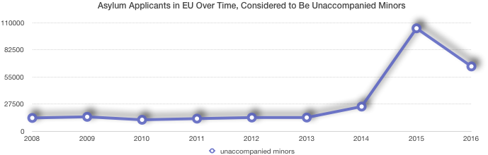
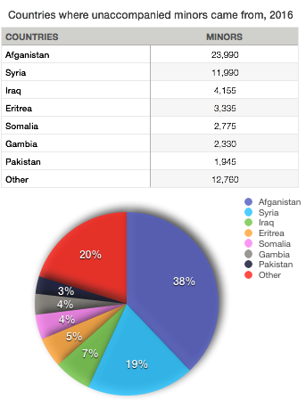
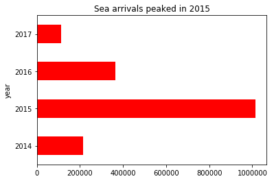
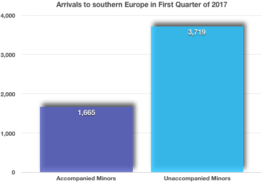
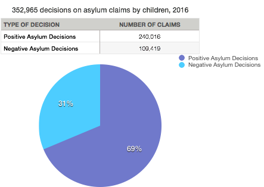
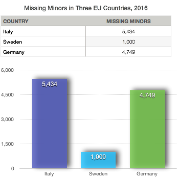

---

title: A Very Cool Project
layout: project

---

# The disappearing flood of unattended minors in the EU

Despite risks, unaccompanied minors continue to flood into Europe in hope of one day being able to pave for themselves a stable future and help those they have left behind.

In 2015, 88.300 asylum seekers applying for international protection in the Member States of the European Union (EU) were considered to be unaccompanied minors. While their number always stood between 11.000 and 13.000 in the EU over the period 2008-2013, it almost doubled in 2014 to reach slightly more than 23.000 persons, then nearly quadrupled in 2015. 

But in 2016, the European Union received slightly more than 63.000 asylum applications from unaccompanied minor migrants, a decline of nearly 35% from 2015’s record total. 

The peak of refugee flows in Europe in the summer of 2015 came as a direct result of the continuation of the conflict in Syria but also of the ongoing violence in Afghanistan and Iraq and abuses in Eritrea. The majority (38%) came from Afghanistan, followed by Syrians (19%) and Iraqis (7%).

Most people come to Europe by sea. As it can be easily drawn from the graph below that groups by data from the UN Refugee Agency since 2014, sea arrivals peaked in 2015. The month during which most refugees took the risk (221,638) was October of 2015.

In 2017, available data covers only the first quarter of the year for arrivals in the southern European borders of Greece, Italy, Bulgaria and Spain.

What is striking though is that most children refugees crossing EU southern borders are still unaccompanied minors. 

More specifically, in that period, 5.384 children arrived in these four countries. Of those 3.719 (69%) were unaccompanied or separated children. 

Furthermore, among the 3.714 children who arrived to Italy, 94% (3.491) were unaccompanied or separated. Arrival of UASC in this country increased by 30% compared to the first quarter in 2016 (2.680). 

So, why are most children unaccompanied? Certainly what data implies as a clear possibility is the likelihood of them being granted a positive asylum claim. In 2016, a total of 352,965 decisions on asylum claims by children have been issued. Of them, 68% were positive and 31% rejected. Among children with positive decisions, 53% were granted refugee status, 37% received subsidiary protection and 10% received humanitarian status. 

During the first quarter of 2017, an additional 50.201 children claimed asylum in Europe. Nationalities remain consistent with last year. Although children make up 28% of all asylum seekers in Europe, in Germany they represented 41.6% of all new claims. 

Moreover, 47% of all children (22.637) sought international protection in Germany. 

Around half of them are young children (0 to 5 years old) and another 3.379 are UASC. Despite the much higher numbers of arrivals through the Central Mediterranean route, in the first quarter of 2017 more children claimed asylum in Greece (5.927) than in Italy (4.010), which suggests that many UASC reaching Italian shores may not be claiming international protection. 

Should this be alarming to the authorities?

##Europol: 10.000 unaccompanied minors in 2016 gone missing 

The EU’s law enforcement agency Europol said that at least 10,000 UAM had disappeared in Europe in 2016. The Italian authorities had reported in August 2015 that of 14378 migrant minors registered as arrivals in the country, 5434 were untraceable. 

Meanwhile, Sweden had reported about 1.000 such minors were missing from centers there. Finally, the German Federal Police have confirmed to German media that 4749 unaccompanied refugee children and teens have been reported missing as of January 2016, an increase from 1637 reported missing in July 2015. 

We contacted Europol asking for more specific figures, thinking that an international organization cannot release such a broad estimation. They got back to us explaining that there is concern that some of these missing children “may be exploited by criminal gangs”. 

More specifically, at an internal document that was declassified upon our request, Europol explains that there is “concern that vulnerable, unaccompanied minors arriving in the E.U. could become targets of exploitation”.

Furthermore, the law enforcement body, which tracks trafficking suspects, says there has been a significant increase in the number of “Trafficking in Human Beings” contributions sent by Member States to Europol. 

According to the document, the majority of these cases contributed to Europol are on sexual exploitation but other types are labour exploitation, sham marriages, forced begging and forced criminality. 

Europol is specifically concerned because it has detected suspects who were previously featured in Human Trafficking files now appearing in their Illegal Immigration work. 

Recent information suggests that smugglers are using minors to crew/steel migrant vessels as they will not be subject to prosecution in respect of facilitating illegal immigration. 

But Europol, recognizes that many of the missing minors “will simply have continued their journeys towards their intended destination” and that “some will have joined or been collected by family or friends”. 

##Uncovered education needs for refugee children

Unfortunately that doesn’t mean all of their problems are solved. On the contrary, as the migration flows decrease, the attention for these children swifts towards their real needs as they try to integrate into their new societies. Although data on refugee and migrant children out of school is largely missing, it is estimated that on average just 2 in every 10 children are in formal education in Greece, Serbia and Bulgaria. 

According to the joint report of UNICEF, IOM and UNHCR, refugee and migrant children trying to sneak into Europe through the eastern Mediterranean route have missed 2.5 years of school on average, while 28% of those who were interviewed and pick the central Mediterranean route to go mainly to Italy, are reported to have been out of school for more than a year, 25% never went to school, 26% were absent from school for less than a year and 21% between 1 and 2 years. In Germany there is an estimated 184,100 school-age child asylum seekers (based on caseload in 2015-2017) but the number of refugee and migrant children out of school across the country remains unknown.

It needs to be said though that reliable data on the number of UASC either arriving to, or currently residing in, different European countries is often unavailable. The number of asylum applications filed by UASC is used to provide an indication of trends but does not necessarily provide an accurate picture of the caseload due to backlogs in national asylum systems, onward irregular movements or not applying for asylum at all. In addition, due to different definitions and national procedures and practices, collecting accurate data on separated children specifically is very challenging (e.g. separated children being registered as either accompanied or unaccompanied). 

